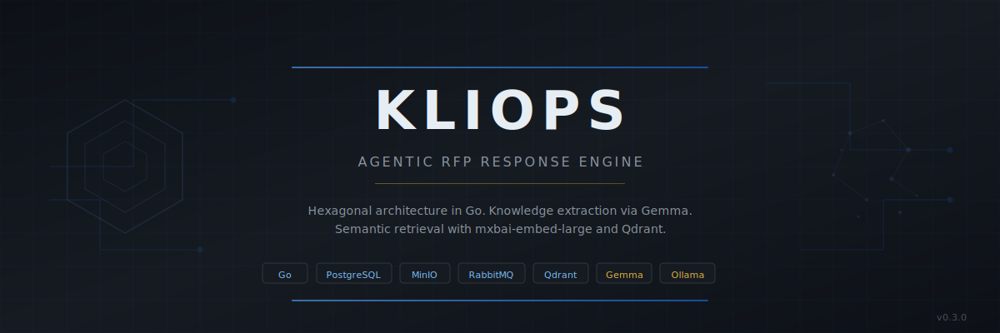

<p align="center">
  
</p>

<p align="center">
  <a href="https://github.com/MiltonJ23/Kliops/actions/workflows/ci.yml"></a>
  <a href="https://github.com/MiltonJ23/Kliops/pkgs/container/kliops"></a>
  <a href="https://github.com/MiltonJ23/Kliops/blob/main/LICENSE"></a>
</p>

<p align="center">
  
  
  
  
</p>

<p align="center">
  
  
  
  
  
  
</p>

---

Kliops is an agentic RFP (Request for Proposal) response engine built in Go for the French BTP (Building and Public Works) sector. It ingests historical tender documents, extracts structured knowledge using Gemma, indexes it into a vector database, and generates technical memorandums from reusable requirement-response pairs.

## Table of Contents

- [Architecture](#architecture)
- [Ingestion Pipeline](#ingestion-pipeline)
- [API](#api)
- [Infrastructure](#infrastructure)
- [Getting Started](#getting-started)
- [API Documentation](#api-documentation)
- [License](#license)

## Architecture

Hexagonal architecture with strict separation between domain logic and external infrastructure.

```text
cmd/kliops-api/main.go            HTTP server, dependency wiring
internal/core/domain/              Domain entities
internal/core/ports/               Interface contracts
internal/core/services/            Business logic orchestration
internal/adapters/handlers/        HTTP handlers, middleware
internal/adapters/repositories/    PostgreSQL, MinIO, Qdrant adapters
internal/adapters/llm/             Gemma extractor, Ollama embedder
internal/adapters/queue/           RabbitMQ adapter
internal/adapters/parser/          PDF text extraction
internal/adapters/google_workspace/ Google Docs integration
```

The **Strategy Pattern** drives pricing: three interchangeable backends (PostgreSQL, Excel via MinIO, external ERP API) implement the same `PricingStrategy` port.

Async processing uses RabbitMQ with retry semantics (3 attempts, exponential backoff) and a dead-letter queue for failed jobs.

Full architecture documentation is available in the [Wiki](https://github.com/MiltonJ23/Kliops/wiki/Architecture).

## Ingestion Pipeline

```text
ZIP (manifest.csv + PDFs)
  |
  v
ArchiveService ---[tx]--> PostgreSQL (projects, documents, jobs)
  |                          |
  v                          v
MinIO (dce-archive/)     RabbitMQ (ingestion_jobs)
                             |
                             v
                      WorkerService
                         |     |
              PDF parse  |     |  Embed chunks
              (MinIO)    |     |  (mxbai-embed-large)
                         v     v
                    GemmaExtractor
                    (exigence, reponse) pairs
                         |
                         v
              Qdrant (memoire_technique)
              PostgreSQL (reponses_historiques)
```

Each DCE chunk is matched against the top-3 most similar MEMOIRE chunks (cosine similarity > 0.40) before being sent to Gemma for structured extraction.

## API

All endpoints under `/api/v1/` require the `X-API-KEY` header.

| Method | Path                        | Description                              |
|--------|-----------------------------|------------------------------------------|
| GET    | `/health`                   | Health check (no auth)                   |
| POST   | `/api/v1/upload`            | Upload a DCE document (field: `document`, max 50 MB) |
| GET    | `/api/v1/price`             | Query unit price by `source` and `code`  |
| POST   | `/api/v1/ingest/archive`    | Upload ZIP archive (field: `archive`) for async ingestion. The ZIP must contain a `manifest.csv` and the referenced PDF files |
| POST   | `/api/v1/ingest/mercuriale` | Upload XLSX price list (field: `excel_file`) |
| POST   | `/api/v1/ingest/template`   | Upload DOCX company charter template (field: `template_file`) |

See the full [API Reference](https://github.com/MiltonJ23/Kliops/wiki/API-Reference) in the Wiki or the [OpenAPI specification](docs/openapi.yaml).

## Infrastructure

| Service    | Image                  | Role                              | Ports       |
|------------|------------------------|-----------------------------------|-------------|
| PostgreSQL | postgres:15-alpine     | Relational store                  | 5432        |
| MinIO      | minio/minio            | S3-compatible object storage      | 9000, 9001  |
| RabbitMQ   | rabbitmq:4-management  | Async job queue                   | 5672, 15672 |
| Qdrant     | qdrant/qdrant          | Vector database (gRPC)            | 6333, 6334  |
| Ollama     | (external)             | LLM runtime (Gemma + embedder)    | 11434       |

All services except Ollama are defined in `deployments/docker-compose.yml` for local development and in `deployments/k8s/kliops.yaml` for Kubernetes.

## Getting Started

### Prerequisites

- Go 1.25+
- Docker and Docker Compose
- Ollama with `gemma` and `mxbai-embed-large` models

### Quick Start

```bash
# Clone
git clone https://github.com/MiltonJ23/Kliops.git
cd Kliops

# Configure environment
cp .env.example .env   # then edit values

# Start backing services
make docker-up

# Apply database migrations
sql-migrate up

# Build and run the API
make run

# Verify
curl http://localhost:8070/health
```

### Docker

```bash
docker build -t kliops-api .
docker run --rm -p 8070:8070 --env-file .env kliops-api
```

The container image is also published to GHCR:

```bash
docker pull ghcr.io/miltonj23/kliops:latest
```

### Tests

```bash
make test
```

### Kubernetes

A single manifest at [`deployments/k8s/kliops.yaml`](deployments/k8s/kliops.yaml) deploys the full stack — PostgreSQL, MinIO, RabbitMQ, Qdrant, and the Kliops API — with persistent volumes, health probes, and an Ingress.

```bash
# Edit the Secret values in deployments/k8s/kliops.yaml before applying
# Replace NAMESPACE_PLACEHOLDER, IMAGE_REPOSITORY_PLACEHOLDER, IMAGE_TAG_PLACEHOLDER

kubectl apply -f deployments/k8s/kliops.yaml
```

The [`deploy.yml`](.github/workflows/deploy.yml) GitHub Actions workflow automates this: it renders the placeholders and runs `kubectl apply`.

## API Documentation

The OpenAPI 3.0 specification is available at [`docs/openapi.yaml`](docs/openapi.yaml).

To explore it interactively, paste the file contents into [Swagger Editor](https://editor.swagger.io/) or use any OpenAPI-compatible viewer.

## License

[GNU Affero General Public License v3.0](LICENSE)
